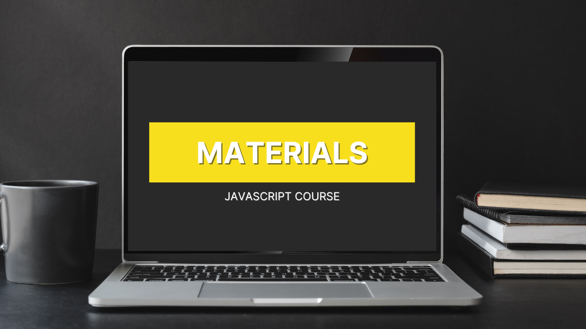

<div align="center" id="about">
    <h1 align="center">
        JavaScript Course
    </h1>
    <p align="center">
        This repository was created to store and organize all materials used in the complete JavaScript course published on YouTube. It brings together practical examples, exercises, code snippets, and projects developed throughout the lessons, covering everything from the basics of programming logic to advanced topics such as DOM manipulation, Fetch API, async/await, localStorage, and more. The content is structured in a didactic way to facilitate learning and help both beginners and those looking to reinforce their JavaScript knowledge.
    </p>
    
</div>
<br>
<div align="center">
    <a href="https://github.com/arturbomtempo-dev/javascript-youtube-course" target="_blank">
        
    </a>
    <a href="https://github.com/arturbomtempo-dev/javascript-youtube-course" target="_blank">
        
    </a>
    <a href="https://github.com/arturbomtempo-dev/javascript-youtube-course/issues" target="_blank">
        
    </a>
    <a href="https://github.com/arturbomtempo-dev/javascript-youtube-course/blob/main/LICENSE.md" target="_blank">
        
    </a>
</div>

---

<div align="center">
    <p>🇧🇷 <a href="https://github.com/arturbomtempo-dev/javascript-youtube-course/blob/main/README.md" target="_blank"><strong>Versão em português disponível aqui</strong></a></p>
</div>

<br>

<div id="table-of-contents"></div>

## 📋 Table of Contents

- [About](#about)
- [Table of Contents](#table-of-contents)
- [What You'll Find in This Repository](#features)
- [Setup and Running the Examples](#setup-and-run-the-application)
- [Technologies](#technologies)
- [Author](#author)
- [License](#license)

<div id="features"></div>

## 📝 What You'll Find in This Repository

- [x] Step-by-step code examples explained in the course lessons
- [x] Practice exercises to reinforce the concepts learned
- [x] Source code for the projects developed throughout the course

<div id="setup-and-run-the-application"></div>

## 📁 Setup and Running the Examples

### ⚙️ Prerequisites

The examples in this course use **vanilla JavaScript**, often together with **HTML**, without requiring external libraries or servers. You can run them in several ways, including directly in your browser.

While not mandatory, it is recommended that you have:

- A **modern web browser** (Google Chrome, Firefox, Edge, etc.)
- A code editor such as [Visual Studio Code](https://code.visualstudio.com/)
- Optionally, an extension like **Live Server** to easily run HTML files locally

---

### 🚀 How to Run the Code

#### ✅ Option 1: Run Directly in the Browser (No Installation Needed)

1. **Open your browser**
2. Press **F12** (Windows) or **Cmd + Option + I** (Mac) to open the developer tools
3. Go to the **Console** tab
4. Type (or paste) your JavaScript code and press **Enter**

> This option is ideal for testing simple examples, such as variables, functions, operators, and control structures.

---

#### ✅ Option 2: Create an HTML File Linked to a JS File

1. Create a folder and inside it, add two files:

   - `index.html`
   - `script.js`

2. In `index.html`, add:

```html
<!DOCTYPE html>
<html lang="en">
  <head>
    <meta charset="UTF-8" />
    <title>My JS Project</title>
  </head>
  <body>
    <h1>Hello, JavaScript!</h1>
    <script src="script.js"></script>
  </body>
</html>
```

3. In `script.js`, write your JavaScript code as usual:

```js
console.log("Hello, world!");
```

4. Open `index.html` in your browser (double-click it or use a server like Live Server)

#### ✅ Option 3: Use an Online Editor

You can also use online platforms to test your code without installing anything:

- [JSFiddle](https://jsfiddle.net/)
- [CodePen](https://codepen.io/)
- [PlayCode](https://playcode.io/)
- [Replit](https://replit.com/)

These tools let you write **HTML**, **CSS**, and **JavaScript** and see the results in real time, making them ideal for practicing the course examples.

<div id="technologies"></div>

## 💻 Technologies

The following languages and technologies were used in the development of the examples and projects in this course:

- [HTML](https://developer.mozilla.org/en-US/docs/Web/HTML): Markup language used to structure web page content.
- [CSS](https://developer.mozilla.org/en-US/docs/Web/CSS): Style language responsible for the appearance and layout of web pages, making them visually appealing and responsive.
- [JavaScript](https://developer.mozilla.org/en-US/docs/Web/JavaScript): Programming language that adds interactivity and logic to web pages, serving as the foundation for the course's examples and projects.

<div id="author"></div>

## 👨🏻‍💻 Author

---

| [<br><sub>Artur Bomtempo</sub>](https://arturbomtempo.dev/) |
| :--------------------------------------------------------------------------------------------------------------------------------------------------: |

Developed by Artur Bomtempo 👋🏻. Get in touch:

[](mailto:arturbcolen@gmail.com)
[](https://www.linkedin.com/in/artur-bomtempo/)
[](https://www.instagram.com/arturbomtempo.dev/)

<div id="license"></div>

## 📜 License

Copyright (c) 2025 Artur Bomtempo Colen

Permission is hereby granted, free of charge, to any person obtaining a copy
of this software and associated documentation files (the "Software"), to deal
in the Software without restriction, including without limitation the rights
to use, copy, modify, merge, publish, distribute, sublicense, and/or sell
copies of the Software, and to permit
